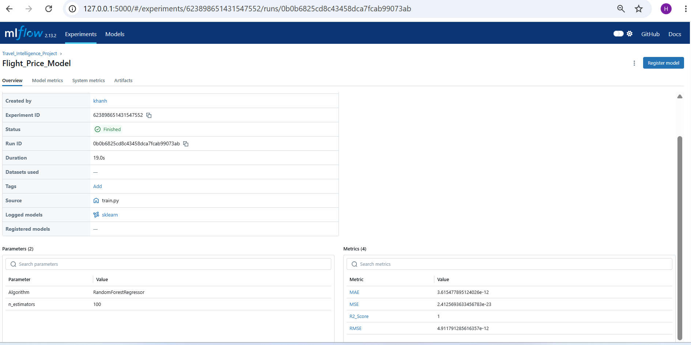

# ✈️ Travel Intelligence Platform

An end-to-end Machine Learning Engineering project that demonstrates how a machine learning model is transformed into a production-ready application using modern MLOps practices.

The project focuses on the **Travel & Tourism** domain and integrates Machine Learning, Flask APIs, Streamlit, Docker, Jenkins, and MLflow into a single production-oriented workflow.

---

# Project Overview

The Travel Intelligence Platform is designed to solve multiple real-world travel problems using Machine Learning.

The platform consists of multiple ML use cases including:

- Flight Price Prediction
- Hotel Recommendation System
- REST API for Real-Time Prediction
- MLflow Experiment Tracking
- Docker Containerization
- Jenkins CI/CD Demonstration

The goal of this project is not only to train ML models but also to demonstrate how they are deployed, managed, versioned, and integrated into a production environment.

---

# Key Features

✔ Flight Price Prediction using Machine Learning

✔ Hotel Recommendation System

✔ Flask REST API

✔ Streamlit Interactive Web Application

✔ MLflow Experiment Tracking

✔ Docker Containerization

✔ Jenkins CI/CD Pipeline

✔ Production-Oriented Project Structure

---

# Tech Stack

| Category | Technology |
|----------|------------|
| Programming Language | Python |
| Machine Learning | Scikit-Learn |
| Data Processing | Pandas, NumPy |
| API Development | Flask |
| Frontend | Streamlit |
| Experiment Tracking | MLflow |
| Containerization | Docker |
| CI/CD | Jenkins |
| Version Control | Git & GitHub |

---

# Project Architecture

```
Dataset
      │
      ▼
Data Preprocessing
      │
      ▼
Feature Engineering
      │
      ▼
Machine Learning Model
      │
      ▼
Model Serialization (.pkl)
      │
      ▼
Flask REST API
      │
      ▼
Streamlit Web Application
      │
      ▼
Docker Container
      │
      ▼
Jenkins CI/CD Pipeline
      │
      ▼
MLflow Experiment Tracking
```

---

# Project Folder Structure

```
Travel-Intelligence-Platform/

│── app.py
│── api.py
│── train.py
│── requirements.txt
│── Dockerfile
│── Jenkinsfile
│── models/
│── data/
│── notebooks/
│── images/
│── README.md
```

---

# Machine Learning Models

### Flight Price Prediction

A regression model that predicts flight ticket prices using multiple travel-related features.

### Hotel Recommendation System

A recommendation engine that suggests hotels based on user preferences.

### Flask Prediction API

The trained model is exposed through a Flask REST API for real-time prediction.

---

# ML Engineering Workflow

The project follows a production-oriented Machine Learning workflow.

- Data Collection
- Data Cleaning
- Feature Engineering
- Model Training
- Model Saving
- Flask API Development
- Streamlit Application
- Docker Packaging
- Jenkins CI/CD
- MLflow Tracking

---

# Docker Demonstration

Docker is used to package the application into portable containers, ensuring that the project runs consistently across different environments.

### Docker Containers


---

### Docker Images


---

# Streamlit Application

The Streamlit application provides an interactive interface for users to make predictions.

### Flight Price Prediction


---

### Hotel Recommendation


---

# MLflow Experiment Tracking

MLflow is used to track machine learning experiments, compare different runs, and manage model versions.

### Flight Price Model



---

# Jenkins CI/CD

Jenkins is integrated to demonstrate Continuous Integration and Continuous Deployment concepts.

The pipeline automates project execution and validates the production workflow.

### Jenkins Pipeline


---

# Future Improvements

- Kubernetes Deployment
- Cloud Deployment (AWS / Azure)
- Airflow Pipeline Automation
- Model Monitoring
- Automatic Model Retraining
- User Authentication
- Recommendation Engine Enhancement

---

# Learning Outcomes

This project helped me understand:

- End-to-End Machine Learning Pipeline
- Production ML Systems
- REST API Development
- Docker Containerization
- Jenkins CI/CD
- MLflow Experiment Tracking
- Model Deployment
- Software Engineering Best Practices

---

# Author

**Husnain Khan**

Data Science | Machine Learning | MLOps | AI

GitHub:
https://github.com/husnain-khan-data

---

⭐ If you found this project useful, please consider giving it a Star.
